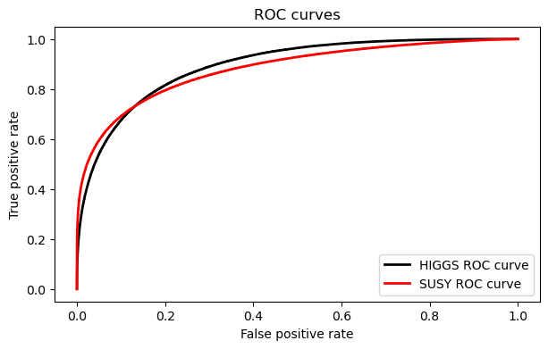

# HIGGS and SUSY Data Analysis

In this repository, the [HIGGS](https://archive.ics.uci.edu/dataset/280/higgs) and [SUSY](https://archive.ics.uci.edu/dataset/279/susy) datasets were analyzed. They both contain data produced using Monce Carlo simulations, where the goal is to train a classifier to find signals in the data. This was originally done by Baldi (2014) [1].

A more in depth presentation of the whole analysis can be seen in the *main.ipynb* notebook. A short summary of the results is presented in this README.

## Datasets

Both datasets are split in a training and validation set. The HIGGS dataset consists of 11'000'000 samples, where the last 500'000 are used for the validation set. For both the training and validation set, $53\%$ of the sample are signal events, and $47\%$ are background. Each sample has 28 features, 21 of which are kinematic properties measured by the accelerator and seven are functions of the first 21 features [1].

The SUSY dataset consists of 5'000'000 samples, where again the last 500'000 are used for the validation set. Both sets have $47\%$ signal and $53\%$ background events. Each sample has 18 features, eight of which are kinematic properties measured by the accelerator and ten are functions of the first 21 features [1].

## Analysis Process

Three different kinds of models are trained for each dataset: A *Random Forest Classifier* $RFC$, an XGBoost model $XGB$, and a *Deep and Wide* $DL$ model [2]. 

The performance of the models is measured with the *Area under the ROC curve* $K$ during training. The performances of the models are compared for both datasets. 

The *Asimov discovery significance* $Z$ [3] is also calculated for the models after training for each dataset. To calculate $Z$, the values from [1] are used, so for $100$ signal and $1000\pm50$ background events. These results are then compared to the results in [1].

## Results

### HIGGS Dataset

The results of the three models for the HIGGS train- and validation set can be seen in the table below.

| **Model** | **Train AUC** | **Validation AUC $K_H$** | **Validation ADS $Z_H$** [$\sigma$] |
| --------- | ------------- | ------------------------ | ----------------------------------- |
| $DL_H$    | $0.902$       | $0.893$                  | $6.97$                              |
| $XGB_H$   | $0.834$       | $0.832$                  | $4.82$                              |
| $RFC_H$   | $0.816$       | $0.811$                  | $4.39$                              |

### SUSY Dataset

The results of the three models for the HIGGS train- and validation set can be seen in the table below.

| **Model** | **Train AUC** | **Validation AUC $K_S$** | **Validation ADS $Z_S$** [$\sigma$] |
| --------- | ------------- | ---------------------- | --------------------------------- |
| $DL_S$    | $0.880$       | $0.880$                | $11.2$                            |
| $XGB_S$   | $0.880$       | $0.878$                | $11.0$                            |
| $RFC_S$   | $0.898$       | $0.876$                | $10.8$                            |

## Discussion

### HIGGS Dataset

$RFC_H$ performs the worst and $DL_H$ the best by a significant margin. This can be observed because the relations between the features relevant for finding signals are too complex to be picked up by the $RFC$ and $XGB$ models.

We can now compare the results of $DL_H$ to the best performing model in [1] $DN_H$. $DN_H$ reaches an AUC of $K_H^{DN}=0.885$, which is lower than the AUC of $DL_H$ at $K_H^{DL}=0.893$, but only by a very slight margin. We can see a much larger improvement in the ADS, where $DN_H$ reaches a value of $Z_H^{DN}=5.0\sigma$, while $DL_H$ gets to $Z_H^{DL}=7.0\sigma$. 

The AUC is calculated over all false positive rates, while the ADS only uses the optimal one for our numbers of signal and background events. Since we assume a ratio of around $10$ between the background and signal events, only the performance of the model at low false positive rates is actually relevant when we try to maximize the discovery significance. Since $DL_H$ reaches a significantly higher true positive rates at a low false positive rate when compared to $DN_H$, and later the two models perform similarly, the difference between $Z_H^{DL}$ and $Z_H^{DN}$ is much larger than between $K_H^{DL}$ and $K_H^{DN}$. 

The ideal values for $Z_H^{DL}$ are found at a threshold of $0.950$, where the true positive rate is $27.0\%$ and the false positive rate $0.773\%$.

### SUSY Dataset

The performance of the models on the validation set is very similar for both the AUC and ADS, but $DL_S$ narrowly performs the best, while $RFC_S$ performs the worst.

We can again compare the results of $DL_S$ to the best performing model in [1]  $DN_S$. $DN_S$ reaches an AUC of $K_S^{DN}=0.879$, which is practically identical to the AUC of $DL_S$ at $K_S^{DL}=0.880$. We can see a much larger improvement in the ADS, where $DN_S$ reaches a value of $Z_S^{DN}=7.6\sigma$, while $DL_H$ gets to $Z_S^{DL}=11\sigma$. The reason for this is again the same as for the HIGGS dataset, resulting in the difference between $Z_S^{DL}$ and $Z_S^{DN}$ being much larger than between $K_S^{DL}$ and $K_S^{DN}$. 

The ideal values for $Z_S^{DL}$ are found at a threshold of $0.988$, where the true positive rate is $20.9\%$ and the false positive rate $0.0414\%$.

### Comparing HIGGS to SUSY Results

An interesting observation between the results for $DL_H$ and $DL_S$ is, that $K_H^{DL}$ is larger than $K_S^{DL}$ while $Z_S^{DL}$ is larger than $Z_H^{DL}$. The reason for this is again, that only the region of the ROC curve at low false positive rates is relevant for the ADS. 

We would expect the ROC curve for $DL_S$ to be higher at low false positive rates than for $DL_H$, and lower at high false positive rates. The ROC curves for $DL_H$ and $DL_S$ can be seen below.

We can clearly see that the ROC curves follow the expected patterns.

## References

[1]: Baldi, P. and Sadowski, P. and Whiteson, D., Nature Communications, 2014, *Searching for exotic particles in high-energy physics with deep learning*, http://dx.doi.org/10.1038/ncomms5308.

[2]: Heng-Tze Cheng and Levent Koc and Jeremiah Harmsen and Tal Shaked and Tushar Chandra and Hrishi Aradhye and Glen Anderson and Greg Corrado and Wei Chai and Mustafa Ispir and Rohan Anil and Zakaria Haque and Lichan Hong and Vihan Jain and Xiaobing Liu and Hemal Shah, 2016, *Wide & Deep Learning for Recommender Systems*, https://arxiv.org/abs/1606.07792.

[3]: Adam Elwood and Dirk Krücker, 2018, *Direct optimisation of the discovery significance when training neural networks to search for new physics in particle colliders*, https://arxiv.org/abs/1806.00322.
